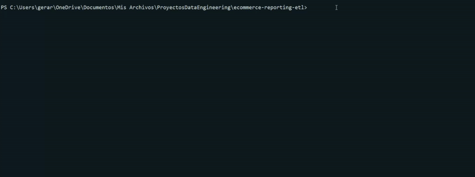
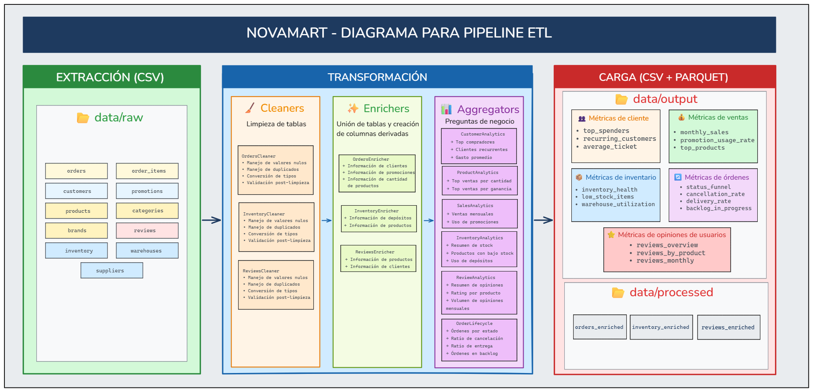

# E-commerce Reporting ETL


<p align="center">
  
</p>

## Overview

Pipeline ETL que automatiza la generación de métricas de negocio para **NovaMart**, un e-commerce en crecimiento. Transforma 11 tablas transaccionales en 17 métricas accionables, reduciendo el tiempo de procesamiento de 2 horas manuales a segundos.

**Stack:** Python 3.13 · Pandas · PyArrow · Pytest

## Arquitectura

<p align="center">
  
</p>

> 📖 Documentación detallada en [docs/](docs/)

## Input / Output

| Input | Output |
|-------|--------|
| 11 CSVs en `data/raw/` | 3 datasets enriquecidos (orders, inventory, reviews) |
| ~10K registros transaccionales | 17 métricas de negocio |
| | Formatos: Parquet (8x compresión) + CSV |

**Métricas generadas:** top_spenders, recurring_customers, monthly_sales, promotion_usage_rate, stock_health, low_stock_items, rating_overview, status_funnel, cancellation_rate, entre otras.

## Estructura de directorios del proyecto

```
ecommerce-reporting-etl/
├── config/settings.py      # Configuración centralizada
├── src/
│   ├── extract/            # CSVExtractor (patrón Template Method)
│   ├── transform/
│   │   ├── cleaners/       # OrdersCleaner, InventoryCleaner, ReviewsCleaner
│   │   ├── enrichers/      # Joins con tablas dimensionales
│   │   └── aggregators/    # 6 agregadores → 17 métricas
│   ├── load/               # ParquetLoader, CSVLoader
│   ├── pipeline/           # Orquestación extract.py, transform.py, load.py
│   ├── exceptions/         # Jerarquía ETLError por fase
│   └── utils/              # Logger con Run ID, validators
├── tests/                  # Pytest con fixtures compartidas
├── docs/                   # Documentación técnica detallada
└── data/                   # raw/ → processed/ → output/ (ignorado por control de versiones)
```

## Cómo ejecutar

### 1. Requisitos previos

| Requisito | Versión mínima | Verificar instalación |
|-----------|----------------|----------------------|
| Python | 3.13+ | `python --version` o `python3 --version` |
| pip | cualquiera | `pip --version` o `pip3 --version` |
| git | cualquiera | `git --version` |

### 2. Clonar el repositorio

```bash
git clone https://github.com/Gerardo1909/ecommerce-reporting-etl.git
cd ecommerce-reporting-etl
```

### 3. Crear y activar entorno virtual

<details>
<summary><b>🪟 Windows (PowerShell)</b></summary>

```powershell
python -m venv venv
.\venv\Scripts\Activate.ps1
```

> Si aparece error de permisos, ejecutar primero: `Set-ExecutionPolicy -ExecutionPolicy RemoteSigned -Scope CurrentUser`

</details>

<details>
<summary><b>🪟 Windows (CMD)</b></summary>

```cmd
python -m venv venv
venv\Scripts\activate.bat
```

</details>

<details>
<summary><b>🍎 macOS / 🐧 Linux</b></summary>

```bash
python3 -m venv venv
source venv/bin/activate
```

</details>

Una vez activado, verás `(venv)` al inicio de la línea de comandos.

### 4. Instalar dependencias

```bash
pip install -r requirements.txt
pip install -e .
```

El flag `-e` instala el paquete en modo desarrollo (editable).

### 5. Ejecutar el pipeline

```bash
python src/main.py
```

Los resultados se generarán en `data/output/` y `data/processed/` (Parquet + CSV).

> ⚠️ **Importante:** El directorio `data/raw/` debe contener los 11 archivos CSV fuente para una ejecución exitosa.

## Testing

Teniendo activo el entorno virtual generado en la sección anterior, simplemente con ejecutar 
el siguiente comando en la terminal se ejecutarán todas las pruebas unitarias:

```bash
pytest                              
```

Esto generará los reportes de testing correspondientes en el directorio `reports/`.

---

**Autor:** Gerardo Toboso · [gerardotoboso1909@gmail.com](mailto:gerardotoboso1909@gmail.com)

**Licencia:** MIT